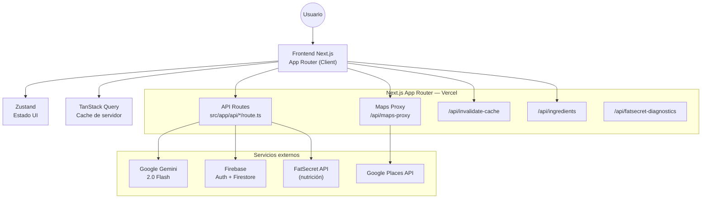

<div align="center">

# 🥗 Bocado AI

## Guía Nutricional Inteligente

Recomendaciones personalizadas con IA, geolocalización para comer fuera y experiencia PWA offline.


</div>

---

## ✨ ¿Qué es Bocado AI?

Bocado AI es una plataforma nutricional inteligente de alto rendimiento diseñada para adaptar recomendaciones al perfil biográfico y situacional del usuario en tiempo real.

- **Inteligencia Situacional**: Recomendaciones basadas en geolocalización real y contexto de viaje (detecta automáticamente si el usuario está de visita en otra ciudad).
- **Seguridad Nutricional**: Motor de filtrado estricto para alergias predefinidas, alergias manuales (`otherAllergies`) y enfermedades crónicas.
- **Zero Waste Logic**: Priorización inteligente de ingredientes próximos a vencer en la despensa para reducir el desperdicio.
- **Unified Engine**: Sistema centralizado de notificaciones inteligentes y recordatorios vía Web Push y local scheduling.
- **Soporte PWA**: Experiencia instalable con capacidades offline vía `@ducanh2912/next-pwa`.

## 🧭 Navegación rápida

- [Inicio rápido](#-inicio-rápido)
- [Stack tecnológico](#️-stack-tecnológico)
- [Variables de entorno](#-variables-de-entorno)
- [Scripts disponibles](#-scripts-disponibles)
- [Arquitectura](#️-arquitectura-y-flujo-de-datos)
- [API](#-endpoints-api)
- [Tests](#-estrategia-de-testing)
- [Despliegue](#-despliegue)
- [Docs relacionadas](#-documentación-relacionada)

## 🚀 Highlights

| Feature | Descripción |
| --- | --- |
| **Audit Proven** | Arquitectura auditada en seguridad, calidad de código, UX y accesibilidad (WCAG). |
| **Recomendaciones IA** | Motor con Gemini 2.0 Flash y lógica avanzada de anti-alucinación. |
| **Seguridad de APIs** | Proxy de Google Maps y rate limiting multi-capa (IP + usuario). |
| **App Router** | Migración completa a Next.js 16 App Router con Server y Client Components. |
| **Internacionalización** | Soporte nativo ES/EN con sistema de traducción propio (`I18nContext`). |
| **UX Multi-dispositivo** | Layout adaptativo optimizado para móvil (PWA) y escritorio. |

## 🛠️ Stack Tecnológico

- **Framework**: Next.js 16 (App Router) + React 19 + TypeScript (strict mode)
- **Estado**: Zustand (UI state) + TanStack Query (server state con caching)
- **API Routes**: Next.js App Router (`src/app/api/*/route.ts`)
- **Base de datos**: Firebase Firestore + Firebase Auth
- **IA**: Google Gemini 2.0 Flash (Generative AI)
- **Validación**: Zod (type-safety de extremo a extremo)
- **PWA**: `@ducanh2912/next-pwa` + Workbox
- **Design System**: Tailwind CSS con tokens custom (`bocado-green`, `bocado-cream`, etc.)
- **Testing**: Vitest (unit) + Playwright (E2E)
- **i18n**: Contexto propio — traducciones en `src/locales/es.json` y `en.json`

## 📋 Requisitos

- Node.js 20 (recomendado)
- npm
- Proyecto Firebase configurado (Auth + Firestore)
- Variables de entorno configuradas (ver sección siguiente)

## ⚡ Inicio rápido

```bash
npm install
npm run dev
```

App local: `http://localhost:3000`

## 🔐 Variables de entorno

Crea un archivo `.env.local` en la raíz del proyecto (o configura en Vercel > Project Settings > Environment Variables).

### Cliente — variables públicas (`NEXT_PUBLIC_*`)

```bash
NEXT_PUBLIC_FIREBASE_API_KEY=
NEXT_PUBLIC_FIREBASE_AUTH_DOMAIN=
NEXT_PUBLIC_FIREBASE_PROJECT_ID=
NEXT_PUBLIC_FIREBASE_STORAGE_BUCKET=
NEXT_PUBLIC_FIREBASE_MESSAGING_SENDER_ID=
NEXT_PUBLIC_FIREBASE_APP_ID=
NEXT_PUBLIC_FIREBASE_VAPID_KEY=

# Opcionales
NEXT_PUBLIC_SENTRY_DSN=
NEXT_PUBLIC_APP_VERSION=local
NEXT_PUBLIC_ADMIN_UIDS=uid1,uid2   # UIDs con acceso al panel de administración
```

### Servidor — solo disponibles en API Routes

```bash
FIREBASE_SERVICE_ACCOUNT_KEY=    # JSON completo del service account de Firebase Admin
GOOGLE_MAPS_API_KEY=             # Nunca exponer en cliente — usar siempre /api/maps-proxy
GEMINI_API_KEY=
FATSECRET_KEY=                   # Opcional — enriquecimiento nutricional
FATSECRET_SECRET=                # Opcional
CACHE_STATS_KEY=                 # Opcional — protege GET /api/invalidate-cache
ALLOWED_ORIGINS=                 # Opcional — orígenes adicionales separados por coma
```

> **⚠️ Seguridad**: `FIREBASE_SERVICE_ACCOUNT_KEY` debe contener el JSON completo del service account. `GOOGLE_MAPS_API_KEY` nunca debe usarse en el frontend — todas las llamadas van al proxy `/api/maps-proxy`. Las variables sin prefijo `NEXT_PUBLIC_` solo están disponibles en el servidor (API Routes).

## 📜 Scripts disponibles

### Desarrollo y build

```bash
npm run dev       # Inicia Next.js en modo desarrollo (puerto 3000)
npm run build     # Build de producción en .next/
npm run start     # Inicia el servidor de producción (requiere build previo)
npm run lint      # ESLint
```

### Tests

```bash
npm run test               # Unit tests con Vitest
npm run test:ui            # Vitest UI interactivo
npm run test:coverage      # Reporte de cobertura

npm run test:e2e                    # E2E con Playwright (headless)
npm run test:e2e:ui                 # E2E interactivo
npm run test:e2e:debug              # E2E en modo debug
npm run test:e2e:headed             # E2E con navegador visible
npm run test:e2e:install-deps       # Instala dependencias del sistema para Chromium
npm run test:e2e:install-browsers   # Instala browsers de Playwright
```

### Utilidades

```bash
npm run generate-icons   # Genera iconos PWA desde el SVG fuente
```

## 🏗️ Arquitectura y Flujo de Datos

Bocado AI sigue una arquitectura Next.js 16 full-stack con App Router. Las API Routes corren en el servidor de Vercel como Edge/Serverless Functions y son el único punto de contacto con servicios externos sensibles.



### Flujo principal de recomendación

1. **Frontend** — captura perfil, despensa y ubicación del usuario. Verifica rate limit antes de mostrar el botón activo.
2. **`POST /api/recommend`** — valida sesión Firebase (Bearer token), verifica rate limit por usuario, construye prompt enriquecido con perfil nutricional y despensa.
3. **Gemini 2.0 Flash** — genera JSON estructurado con receta o restaurante adaptado al perfil.
4. **Frontend** — renderiza `MealCard` con información nutricional, acciones de guardar y feedback.

### Principios de arquitectura

- Los datos se guardan **siempre en español** en Firestore — `t()` solo para UI.
- `firebase-admin` se importa **únicamente** en API Routes (servidor) — nunca en componentes cliente.
- `useAuthStore` usa **selectores granulares** — nunca `getState()` en componentes.
- Errores de geolocalización se retornan como **claves i18n**, no strings.

## 🌐 Endpoints API

Todos los endpoints requieren autenticación mediante `Authorization: Bearer <firebase-id-token>` salvo indicación contraria.

### `POST /api/recommend`

Genera una recomendación nutricional personalizada (receta en casa, restaurante, o receta rápida). Payload validado con Zod (`RecommendationRequestSchema`).

### `GET /api/recommend`

Devuelve el estado de rate limiting para el usuario autenticado.

### `POST /api/maps-proxy`

Proxy autenticado de Google Maps. Protege la API key del lado del servidor. Acciones disponibles:

- `autocomplete` — sugerencias de ciudad (público, con rate limit por IP)
- `placeDetails` — coordenadas y dirección de un lugar
- `geocode` — dirección → coordenadas
- `reverseGeocode` — coordenadas → dirección
- `detectLocation` — detección de ubicación aproximada por IP

### `GET /api/ingredients`

Lista de ingredientes disponibles para el autocompletado de Receta Rápida. Caché de 1 hora.

### `POST /api/invalidate-cache`

Invalida el caché en servidor para el usuario autenticado. Body: `{ type: "profile" | "pantry" | "history" | "all" }`.

### `GET /api/fatsecret-diagnostics`

Verifica la conectividad con la API de FatSecret (enriquecimiento nutricional).

## ☁️ Firebase Cloud Functions (opcional)

La carpeta `functions/` incluye tareas programadas de mantenimiento (cleanup y archivado de datos históricos).

```bash
cd functions
npm install
npm run serve    # Emulador local
npm run deploy   # Despliegue a producción
```

Configuración de Firebase en la raíz:

- Reglas: `firestore.rules`
- Índices: `firestore.indexes.json`

## 🧪 Estrategia de Testing

### Pruebas unitarias (Vitest)

Ubicadas en `src/test/`.

- **Motor de recomendaciones**: validación de lógica de filtrado de ingredientes (alergias, dietas).
- **Sanitización**: verificación de limpieza de datos para Firestore y prompts de IA.
- **Utilidades**: helpers de geocodificación y lógica compartida.

### Pruebas E2E (Playwright)

Ubicadas en `e2e/`.

- **Autenticación**: registro completo y login con Firebase.
- **Onboarding**: verificación de guardado de perfil multi-paso.
- **Despensa**: agregar/eliminar items y persistencia.
- **Recomendaciones**: flujo completo desde botón hasta renderizado de la respuesta de IA.

Configuración: `playwright.config.ts` — Variables de ejemplo: `e2e/.env.test` — Guía: `e2e/README.md`

## 📱 PWA y modo offline

- Configuración PWA: `next.config.mjs` (via `@ducanh2912/next-pwa`)
- Service Worker: generado automáticamente por Workbox en `public/`
- Fallback offline: `public/offline.html`
- Detalle técnico: `docs/PWA_OFFLINE_SETUP.md`

## 🗂️ Estructura principal

```text
src/
├── app/                    Next.js App Router (páginas y API routes)
│   ├── api/                API Routes del servidor
│   │   ├── recommend/      Motor de recomendaciones
│   │   ├── maps-proxy/     Proxy de Google Maps
│   │   ├── ingredients/    Lista de ingredientes
│   │   └── invalidate-cache/
│   ├── dashboard/          Pantalla principal (protegida)
│   ├── login/
│   ├── register/
│   └── plan/[id]/
├── components/             Componentes React
├── contexts/               I18nContext, ThemeContext
├── hooks/                  Custom hooks (useRateLimit, useGeolocation, etc.)
├── lib/
│   └── api/                Utilidades de servidor (firebase-admin, cors-utils, servicios)
├── locales/                Traducciones (es.json, en.json)
├── stores/                 Zustand stores (authStore, pantryStore, profileDraftStore)
├── types.ts                Tipos globales
└── utils/                  Utilidades cliente (profileTranslations, logger, etc.)
functions/                  Firebase Cloud Functions programadas
e2e/                        Pruebas Playwright
docs/                       Documentación funcional y técnica
scripts/                    Scripts de soporte (iconos, CI)
```

## 🚢 Despliegue

### Frontend + API Routes (Vercel)

1. Conecta el repositorio en Vercel.
2. Configura las variables de entorno en **Vercel > Project Settings > Environment Variables**.
3. Despliega — Vercel detecta automáticamente Next.js.
4. Verifica que los endpoints respondan:
   - `POST /api/recommend`
   - `POST /api/maps-proxy`

### Firebase

1. Configura el proyecto Firebase (Auth + Firestore).
2. Publica reglas e índices:

```bash
firebase deploy --only firestore:rules,firestore:indexes
```

3. (Opcional) Despliega Cloud Functions:

```bash
cd functions && npm run deploy
```

## 📚 Documentación relacionada

### Técnica
- `docs/tecnico/arquitectura.md` — Arquitectura detallada del sistema
- `docs/tecnico/modelo-datos.md` — Esquemas de Firestore y tipos TypeScript
- `docs/tecnico/i18n-architecture.md` — Sistema de internacionalización
- `docs/tecnico/FATSECRET_GUIDE.md` — Integración con API de FatSecret
- `docs/tecnico/GOOGLE_SIGNIN_SETUP.md` — Configuración de autenticación Google
- `docs/tecnico/AUDIT_SUMMARY.md` — Resumen de auditorías técnicas
- `docs/tecnico/AUTHENTICATION_AUDIT.md` — Auditoría del sistema de autenticación
- `docs/tecnico/STAFF_ENGINEER_AUDIT.md` — Evaluación de código por ingeniero senior

### Operaciones
- `docs/ops/FATSECRET_VERCEL_SETUP.md` — Setup de FatSecret en Vercel
- `docs/ops/DEBUG_CONSOLE_GUIDE.md` — Guía de debugging en producción  
- `docs/ops/VERIFICATION_GUIDE.md` — Lista de verificación post-deployment
- `docs/ops/IMPLEMENTATION_COMPLETE.md` — Documentación de implementaciones críticas
- `docs/ops/IMPLEMENTATION_ROADMAP.md` — Roadmap de desarrollo técnico

### Features
- `docs/features/RECETA_RAPIDA_IMPLEMENTATION.md` — Feature de receta rápida con ingredientes
- `docs/features/NOTIFICACIONES-FIX.md` — Sistema de notificaciones push
- `docs/features/INGREDIENT_FILTERING_IMPROVEMENTS.md` — Mejoras de filtrado de ingredientes

---

<div align="center">
Hecho para escalar producto, no solo prototipos.
</div>