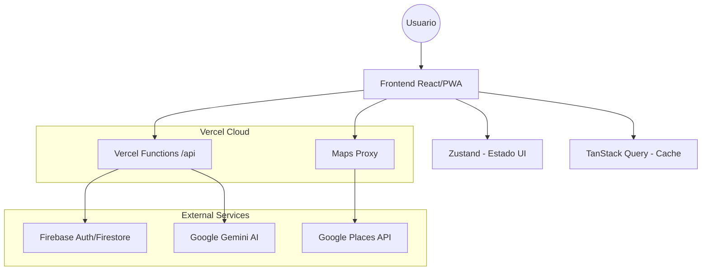

<div align="center">

# 🥗 Bocado AI

## Guía Nutricional Inteligente

Recomendaciones personalizadas con IA, geolocalización para comer fuera y experiencia PWA offline.


</div>

---

## ✨ ¿Qué es Bocado AI?

Bocado AI es una plataforma nutricional inteligente de alto rendimiento diseñada para adaptar recomendaciones al perfil biográfico y situacional del usuario en tiempo real.

- **Inteligencia Situacional**: Recomendaciones basadas en geolocalización real y contexto de viaje (detecta automáticamente si el usuario está de visita en otra ciudad).
- **Seguridad Nutricional**: Motor de filtrado estricto para alergias predefinidas, alergias manuales (`otherAllergies`) y enfermedades crónicas.
- **Zero Waste Logic**: Priorización inteligente de ingredientes próximos a vencer en la despensa para reducir el desperdicio.
- **Unified Engine**: Sistema centralizado de notificaciones inteligentes y recordatorios vía Web Push y local scheduling.
- **Soporte PWA**: Experiencia instalable con capacidades offline.

## 🧭 Navegación rápida

- [Inicio rápido](#-inicio-rápido)
- [Stack actual](#-stack-actual)
- [Variables de entorno](#-variables-de-entorno)
- [Scripts disponibles](#-scripts-disponibles)
- [API](#-endpoints-api)
- [Tests](#-e2e)
- [Despliegue](#-despliegue)
- [Docs relacionadas](#-documentación-relacionada)

## 🚀 Highlights

| Feature            | Descripción                                           |
| ------------------ | ----------------------------------------------------- |
| **Audit Proven**   | Arquitectura optimizada tras auditoría profunda de performance, seguridad y UX. |
| **Recomendaciones IA** | Motor con Gemini 2.0 Flash y lógica avanzada de anti-alucinación. |
| **Seguridad de APIs** | Arquitectura Proxy para proteger llaves y manejar Rate Limiting multi-capa. |
| **UX Multi-dispositivo** | Layout adaptativo optimizado para móvil (PWA) y panel de escritorio. |
| **Internacionalización** | Soporte nativo y completo para Español e Inglés (ES/EN). |

## 🛠️ Stack Tecnológico

- **Frontend**: React 19 + TypeScript + Vite.
- **Estado**: Zustand (UI) + TanStack Query (Estado de servidor con caching).
- **Backend HTTP**: Vercel Functions (Serverless Node.js).
- **Base de Datos**: Firebase Firestore (con optimización de lecturas).
- **IA**: Google Gemini Pro (Generative AI).
- **Validación**: Zod (Type-safety de extremo a extremo).
- **Testing**: Vitest (Unit) + Playwright (E2E).
- **Design System**: Tailwind CSS.

## 📋 Requisitos

- Node.js 20 (recomendado)
- npm
- Proyecto Firebase configurado
- Variables de entorno configuradas

## ⚡ Inicio rápido

```bash
npm install
npm run dev
```

App local: `http://localhost:3000`

## 🔐 Variables de entorno

### Frontend (`.env.local`)

```bash
VITE_FIREBASE_API_KEY=
VITE_FIREBASE_AUTH_DOMAIN=
VITE_FIREBASE_PROJECT_ID=
VITE_FIREBASE_STORAGE_BUCKET=
VITE_FIREBASE_MESSAGING_SENDER_ID=
VITE_FIREBASE_APP_ID=
VITE_FIREBASE_VAPID_KEY=

# Opcionales
VITE_SENTRY_DSN=
VITE_APP_VERSION=local
VITE_REGISTER_USER_URL=
```

### Backend Vercel (Project Settings > Environment Variables)

```bash
FIREBASE_SERVICE_ACCOUNT_KEY=
GOOGLE_MAPS_API_KEY=
GEMINI_API_KEY=
```

Notas:

- `FIREBASE_SERVICE_ACCOUNT_KEY` debe contener el JSON completo de service account.
- No expongas `GOOGLE_MAPS_API_KEY` en frontend. Usa siempre `/api/maps-proxy`.

## 📜 Scripts disponibles

### Desarrollo y build

- `npm run dev`: inicia Vite (puerto 3000)
- `npm run build`: build de producción en `dist/`
- `npm run preview`: previsualiza build

### Tests

- `npm run test`: unit tests (Vitest)
- `npm run test:ui`: Vitest UI
- `npm run test:coverage`: cobertura
- `npm run test:e2e`: E2E Playwright
- `npm run test:e2e:ui`: E2E interactivo
- `npm run test:e2e:debug`: E2E debug
- `npm run test:e2e:headed`: E2E con navegador visible
- `npm run test:e2e:install-deps`: deps del sistema para Chromium
- `npm run test:e2e:install-browsers`: instala browsers Playwright

### UI y utilidades

- `npm run storybook`: Storybook local (`:6006`)
- `npm run build-storybook`: build de Storybook
- `npm run generate-icons`: genera iconos PWA

## 🏗️ Arquitectura y Flujo de Datos

Bocado AI utiliza una arquitectura serverless moderna diseñada para ofrecer recomendaciones en tiempo real con baja latencia.



### Flujo Principal:
1.  **Frontend**: Captura el perfil, despensa y ubicación del usuario.
2.  **Backend (Proxy)**: Valida la sesión y el rate limit antes de procesar la solicitud.
3.  **Motor de IA**: Construye prompts enriquecidos con contexto de salud y existencias reales.
4.  **Respuesta**: Gemini genera JSON estructurado que el frontend renderiza de forma interactiva.

## 🌐 Endpoints API

### `POST /api/recommend`

Genera recomendación nutricional/restaurante. Payload validado con Zod.

### `GET /api/recommend`

Devuelve estado de rate limiting para el usuario autenticado (Bearer token).

### `POST /api/maps-proxy`

Proxy de Google Maps con validación y rate limit. Acciones:

- `autocomplete`
- `placeDetails`
- `geocode`
- `reverseGeocode`
- `detectLocation`

## ☁️ Firebase Functions (opcional)

La carpeta `functions/` incluye tareas programadas de mantenimiento (cleanup/archivado).

```bash
cd functions
npm install
npm run serve
npm run deploy
```

Config raíz Firebase:

- reglas: `firestore.rules`
- índices: `firestore.indexes.json`

## 🧪 Estrategia de Testing

El proyecto sigue una pirámide de pruebas robusta para garantizar la fiabilidad del motor nutricional.

### Pruebas Unitarias (Vitest)
Ubicadas en `src/test/`.
- **Motor de Recomendaciones**: Validación de lógica de filtrado de ingredientes (alergias/dietas).
- **Sanitización**: Verificación de limpieza de datos para Firebase y prompts.
- **Utilidades**: Pruebas de lógica compartida y helpers de geocodificación.

### Pruebas E2E (Playwright)
Ubicadas en `e2e/`.
- **Autenticación**: Registro completo y login con Firebase.
- **Flujo Onboarding**: Verificación de guardado de perfil multi-paso.
- **Gestión de Despensa**: Agregar/eliminar items y persistencia.
- **Generación de Recetas**: Prueba real del flujo desde botón hasta renderizado de propuesta de la IA.

### Ejecución
- Configuración: `playwright.config.ts`
- Variables de test ejemplo: `e2e/.env.test`
- Guía detallada: `e2e/README.md`

## 📱 PWA/offline

- Workbox: `vite.config.ts`
- Fallback offline: `public/offline.html`
- Detalle técnico: `docs/PWA_OFFLINE_SETUP.md`

## 🗂️ Estructura principal

```text
src/            Frontend React
api/            Vercel Functions
functions/      Firebase Cloud Functions programadas
e2e/            Pruebas Playwright
docs/           Documentación funcional/técnica
scripts/        Scripts de soporte (esbuild, iconos, CI)
```

## 🚢 Despliegue

### Frontend + API (Vercel)

1. Configura variables de entorno en Vercel.
2. Conecta el repositorio y despliega.
3. Verifica rutas:
   - `/api/recommend`
   - `/api/maps-proxy`

### Firebase

1. Configura proyecto Firebase.
2. Publica reglas e índices:

```bash
firebase deploy --only firestore:rules,firestore:indexes
```

3. (Opcional) despliega `functions/`.

## 📚 Documentación relacionada

- `docs/03-tecnico/arquitectura.md`
- `docs/03-tecnico/modelo-datos.md`
- `docs/FEATURE_FLAGS.md`
- `docs/UI_COMPONENTS.md`
- `docs/05-ops/deploy-checklist.md`

---

<div align="center">
Hecho para escalar producto, no solo prototipos.
</div>
